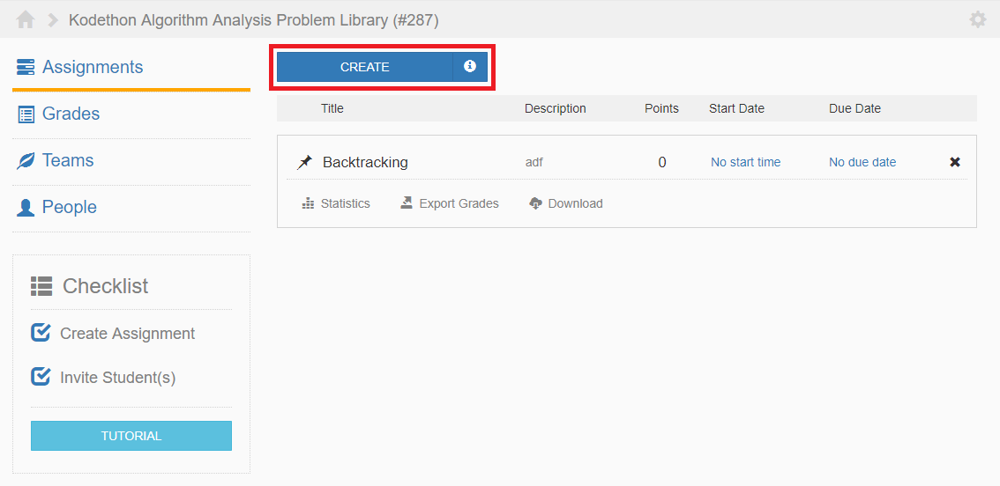

********
Overview
********

.. contents:: Table of Contents 

Description
-----------

An assignment should be comprised of one or more problems. 
It is the first thing that should be created by clicking on the button outlined in red in Figure 1.

    **Figure 1.** Assignments page view

An assignment consists of five components:
    1. Problems
    2. Submissions
    3. Settings
    4. Extensions
    5. Editor

Components
----------

Problems
^^^^^^^^

An assignment must contain one or more problems. The total score of the assignment will be the sum of the max scores of the problems.

Submissions
^^^^^^^^^^^

The submissions tab contains information on all submissions made for the assignment. 
You can also view each submission made for each problem for a particular student.

Extensions
^^^^^^^^^^

Currently we only support extending the due date for individual students.

Settings
^^^^^^^^

Assignment settings are divided into three categories:
    1. Details
    2. Submission
    3. Scores

Editor
^^^^^^

When you create an assignment, a new container will be created for it. 
You can interact with the container by accessing the editor view by clicking on 'Files' tab.

    **Figure 1.** Each section can be accessed via the left navigation menu
