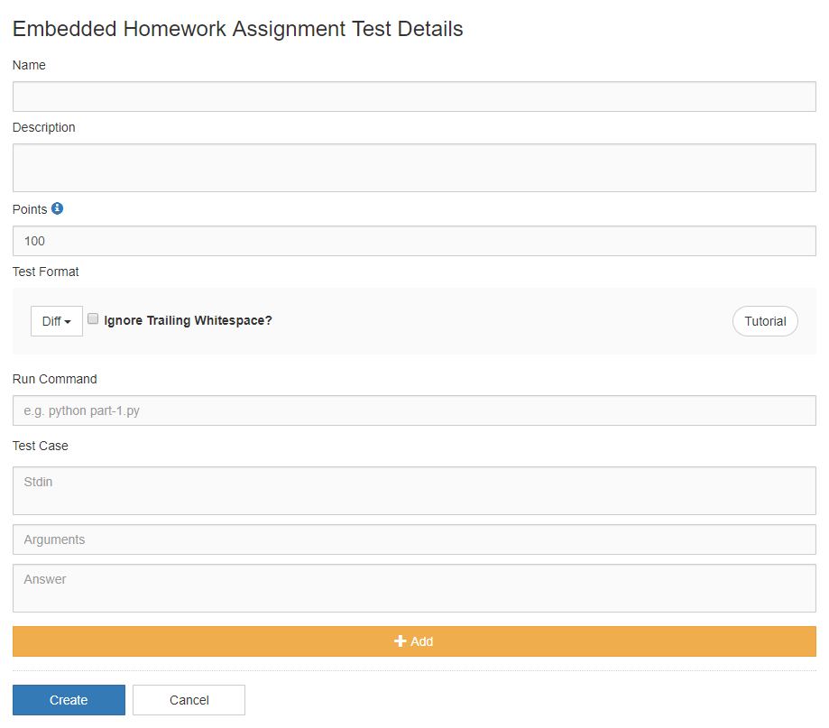
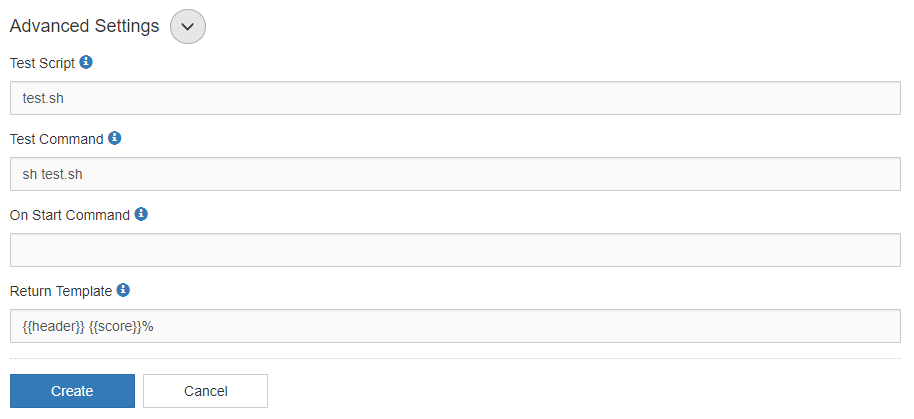

********
Overview
********

.. contents:: Table of Contents 

Problem Types
================

We currently support three types of problems:

    1. Diff
    2. Custom
    3. Multiple Choice
    4. Free Response

Diff
------------

Settings
^^^^^^^^

    **Figure 2.** Test suite creation view

A diff problem is comprised of test cases. For each test case, you can specify:
    
    1. Standard input
    2. Arguments
    3. Expected answer
    4. Comment

When a student submits their program for grading, Kodethon will **generate a test script** based on the problem settings and test cases. 
For example, if you set standard input to be 'abc' and arguments '1 2 3' for **Test Case 1**, then the generated test command will look like:

::
    
    run main.py 1 2 3 < 1 

The specified standard input 'abc' will be written into a file called '1' and redirected into the student's program.

Custom
--------------

Settings
^^^^^^^^

    **Figure 3.** Custom test settings

You also have the option of providing an **On Start Command** that will be run when the student views or copies the assignment.
This setting can be used to generate **Dynamic Problems**; please read this section for more details.

.. cmdoption:: Execution Time

To limit how long the submission can run for, you can specify a max execution time in
seconds. The max execution time will be divided evenly between each test case. For example, if the max execution time was 10 seconds and there are 10 test cases, then each
test case gets 1 second of execution time. 

.. cmdoption:: Period
   
To limit the rate which a submission can be made, you can specific a time in seconds.
The submitter will receive an error message denoting how much time they have left
before they can submit again.
