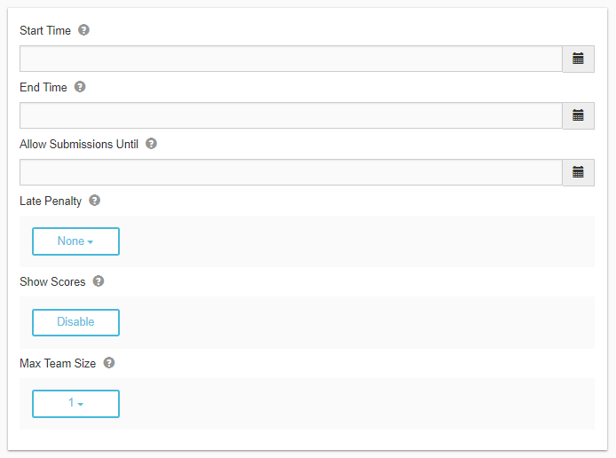

********
Settings
********

Submission Settings
===================

.. cmdoption:: Start Time

The start time of an assignment sets when a user can see and submit solutions to problems within the assignment. 

.. cmdoption:: End Time

The end time of an assignment is a soft limit of when a user can submit solutions to problems within the assignment.

.. cmdoption:: Allow Submissions Until

This setting is a hard limit of when a user can submit solutions to problems within the assignment. 
A **late penalty** (if set) will be aplied to the submission score.

.. cmdoption:: Late Penalty

The late penalty type determines how much points is deducted from the submission score. 
For example, if:
    1. The late penalty type is **Linear**
    2. The **Allow Submissions Until** date is set to 24 hours after the **End Time**
    3. The user submitted exactly 12 hours after the **End Time**
    4. The user received 100 points before the late penalty is applied
Then the resulting score would 50 points (exactly half the max score of 100 points).

.. cmdoption:: Show Scores

If this setting is **Enabled**, then users can see the scores for the assignment.

.. cmdoption:: Max Team Size

This setting defaults to **1** and sets the maximum number of users that can submit together.

    **Figure 1.** Assignment submission settings
