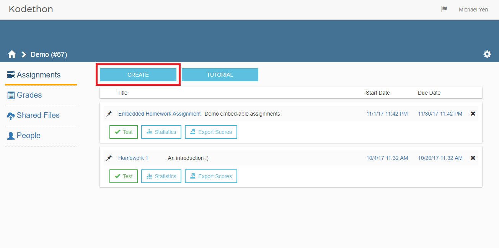

*******************
Assignment
*******************

.. contents:: Table of Contents 

    **Figure 1.** Assignments page view

An assignment is the first thing that should be created by clicking on the button outlined in red in figure 1.
Here you can specify:
    1. Programming environment that will be used to test submissions 
    2. Start date of the assignment
    3. Due date of the assignment
    4. Environment
    
If you happen to set the start after the current date, students within the course will not be able to see the assignment.
