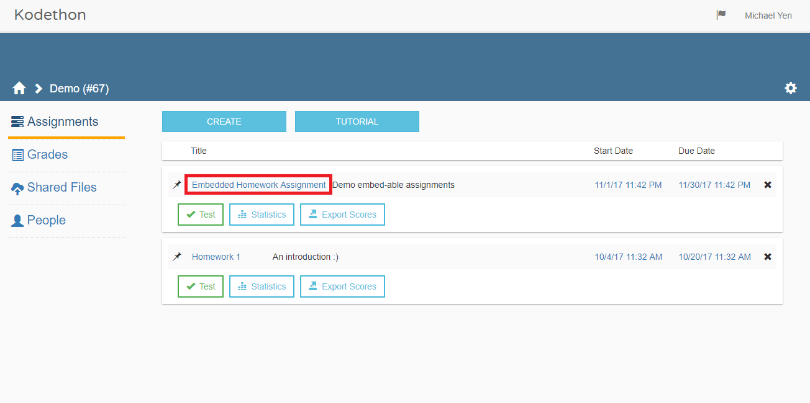
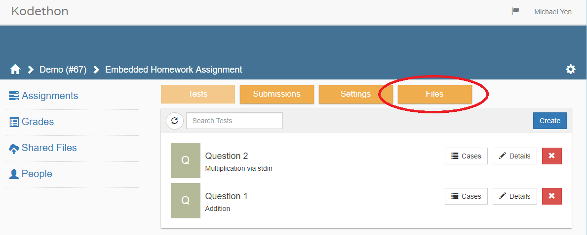

*******************
Embed
*******************

.. contents:: Table of Contents

Pre-requisite
================

    **Figure 1.** Selecting an assignment

First select an assignment by clicking in the area outlined in red in Figure 1. 

    **Figure 2.** Assignment information page
    
Next access your assignment files by clicking on the button circled in red in Figure 2.

Usage
================

::

    embed <TEST_NAME> <FILE_PATH?>

After you have accessed your assignment files, run the above command in the *CDE Shell* to obtain an embed link. 
Embed allows you to place runnable code snippets into your HTML page. Use an iframe
in your HTML page and set the src attribute to the URL obtained with above command. 

.. code-block:: html
    :emphasize-lines: 2

    <iframe src="EMBED_LINK" height="250px" width="750px" frameBorder="0"></iframe>
    
Arguments
================

.. cmdoption:: file_path
Denotes which file to show initially; this argument must be the relative path of an existing file.

Note
================

To prevent un-wanted viewing of files, please make sure that world view permissions are disabled
for the files. Please note that even with world view permissions disabled, files within a **src** folder will still be viewable.
