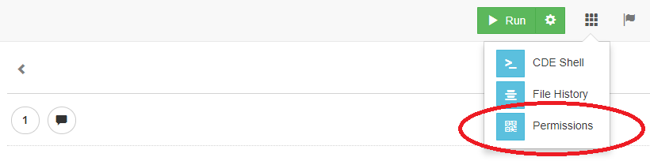
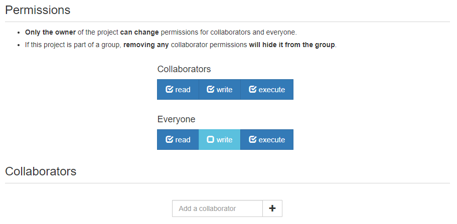

*******************
Permissions
*******************

Pre-requsite
================

    **Figure 1.** How to access permissions

Click on the permission app outlined in red in Figure 1.

Description
================

    **Figure 2.** Default permissions
    
Projects have a default permission of read, write, execute for collaborators and
read and execute for everyone else. The default permissions can be changed by 
toggling them on and off.

Read
================
Read permission determines if the project can be accessed. If you turn off read permission,
users outside the respective group will get a warning that read permission is not enabled.
For example, if read permission is turned off for everyone, then only the owner of the project
and users listed within the collaborators section can access the project.

Write
================
Write permission determines if a user can write to files.
Turning off write permission will prevent users from writing to files
running programs, executing commands in the CDE Shell, and opening a terminal.

Execute
================
Execute permission determines if a user can run programs, 
execute commands in the CDE Shell, and open a terminal.