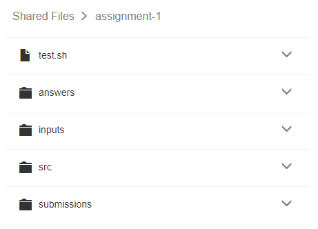

*******************
Auto-test
*******************

.. contents:: Table of Contents 

Pre-requisite
================

A project should have been created and that the commands below are run in the project.

Synopsis
================

::

    generate <TEST_NAME>
    ace config.yml

Description
================

    **Figure 1.** Structure of a test

Open the *CDE Shell* and run:

::

    generate TEST_NAME

Replace TEST_NAME with the name of your test to create the test scaffold. 
This command should have done two things. The first thing is that a folder called TEST_NAME 
should have been created with the folders as shown in **Figure 1.** The second thing is that
if you run:

::

    ace config.yml

You should see that your test configuration should have been
added to the file. In the following sections we will go over how to customize your test.
To customize your test, both the config.yml and the test scaffold have to be modified.

Config.yml
================

The config.yml file must be kept in the root of your files.
Each section in the config file is identified by the test name and four primary components.
These components include **id**, **path**, **test**, and **output**. An example is shown below:

.. code-block:: yaml

    hw-1:
        id: NWExMWQ5OTA4NDAzYzFlYTQxYzJmZTQ5MWI0OGUzMjMjaHctMQ==
        path: "/hw-1"
        test:
            environment: python:2.7.9
            script: test.sh
            command: "cmake CMakeLists.txt && make && ./runTests"
            assets:
                - CMakeLists.txt
            template: "Score: {{ score }}"
        output:
            filename: _output
            format: csv
            template: "{{ id }} {{ score }}"

id
-------------------

The id component is the test id that you give to your users so that they can test their code.

path
-------------------

The path component describes where your test scaffold is located and must be relative to the root of your files.

test
-------------------

The test component is where you describe how your test should be run and takes the following fields:

.. cmdoption:: environment

A valid Kodethon environment of the form *environment:tag* that is available within
the project's settings.

    - python:2.7.9  or python:3.0.0
    - c:5.4.0
    - go:1.3.3
    - java:1.8.0
    - javascript:node-5.6.0
    - lisp:common-2.49
    - php:5.6.24
    - prolog:gnu-1.4.4 or prolog:swi-7.4.1
    - r:3.2.3
    - ruby:2.2.3
    - rust:1.11.0
    - swift:2.2
    
.. cmdoption:: script

The path to your test script relative to your files. e.g. tests.cpp

.. cmdoption:: command

A shell command that should be able to be executed within the project's terminal. 
e.g. cmake CMakeLists.txt && make && ./runTests

.. cmdoption:: template

An array or string that dictates the look of the output returned to the user if 
the output of the test program is in JSON format. Each keyword will be replaced
with the respective value from the JSON object. For example, if the tempate is:

::

    "Score: {{ score }}"
    
and the JSON output is "{id: 1, score: 44}" then the processed result will be:

:: 

    "Score: 44"
    
If the template were instead:

::

    "{{ header }} {{ id }} {{ score }}"

then the processed result using the same JSON output will be:

:: 

    " 1 44"
    
because the header keyword does not exist in the JSON output but id and score do.

.. cmdoption:: assets

An **optional** array of file paths relative to your test folder that will be soft linked into
each submission folder. e.g. CMakeLists.txt and tests.cpp

output
-------------------

.. cmdoption:: filename

The name of the file that will get generated when you run in the CDE Shell:

::

    score TEST_NAME
    
.. cmdoption:: format

The format you expect the output file to be. We currently only support csv.

.. cmdoption:: template

An array or string that dictates the look of each row in the output file. The processing
of the template is the same as the processing for the test ouptut.

Test Scaffold
================

The test scaffold must contain the folder specified by path in the config.yml, a src folder, a submissions folder, and a test script.
The structure should look like:

.. code-block:: yaml

    test-name/
        YOUR_TEST_SCRIPT
        src/
        submissions/
        
Test Script
-------------------
The test script file can be any type of file that should be invoked within the command section in the config.yml

Src
-------------------
The src folder should contain the files you expect your users to have. It must contain a file called README.

Submissions
-------------------
The submissions folder is where user submissions will be stored. 
Inside each submission folder will be the submitted files along with an output file with your test script's output.

Distribute
================

To provide access to your test, copy and paste the test id to your users:

.. code-block:: yaml
    :emphasize-lines: 2

    hw-1:
        id: NWExMWQ5OTA4NDAzYzFlYTQxYzJmZTQ5MWI0OGUzMjMjaHctMQ==
        path: "/hw-1"
        test:
            environment: python:2.7.9
            script: test.sh
            command: "cmake CMakeLists.txt && make && ./runTests"
            assets:
                - CMakeLists.txt
            template: "Score: {{ score }}"
        output:
            filename: _output
            format: csv
            template: "{{ id }} {{ score }}"
