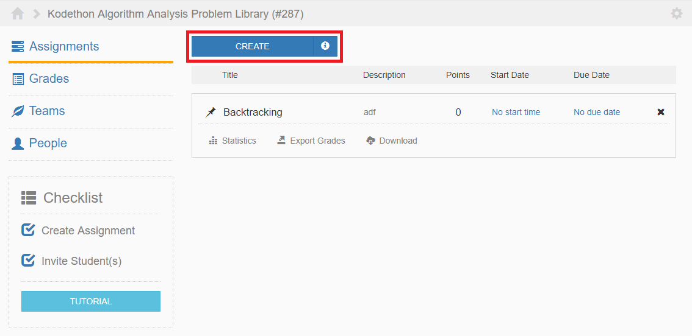

*****************
Create Assignment
*****************

An assignment is comprised of one or more problems. 
To create an assignment, click on on the button outlined in red in the figure below.

    **Figure 1.** Assignments page view

For more information on the different problem types, please visit the **Assignments** section.
