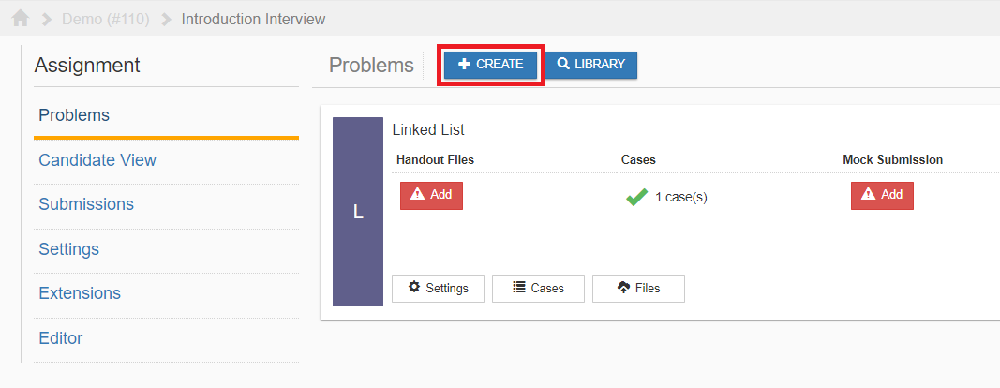

**************
Create Problem
**************

To create a problem, click on the button outlined in red in the figure below.

    **Figure 1.** Problems page view

For more information on the different problem types, please visit the **Problems** section.
