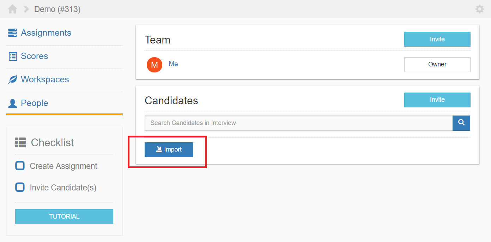

************
Import Users
************

Importing from a file is a quick way to add users. After a user is imported, he or he will not be immediately notified until specified. 
To create an assignment, click on the button outlined in red in the figure below.

    **Figure 1.** Where to import users from

Text File Format
================

The first line must be labeled with **Email** followed by one or more emails. Below is an example of the expected file format. 

.. code-block:: text

   Email
   email1@domain.com
   email2@domain.com
   email2@domain.com
   .
   .
   .
