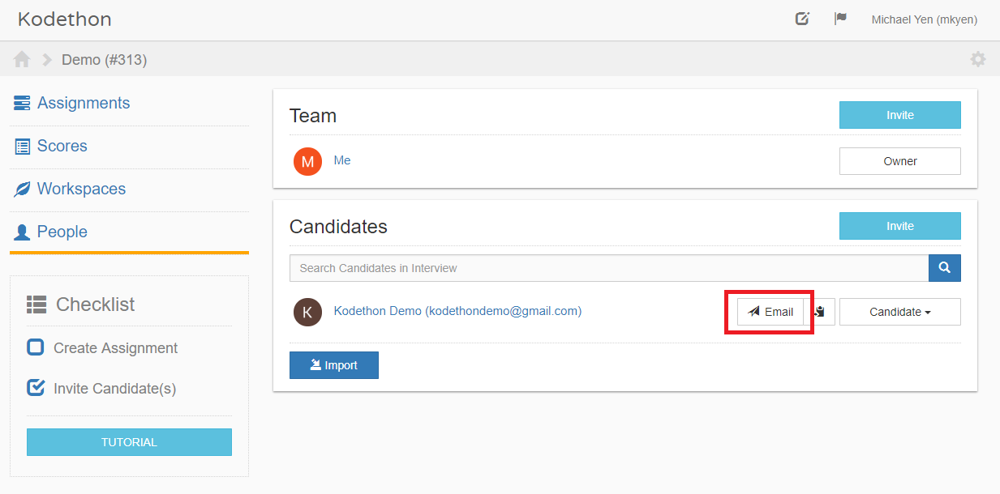
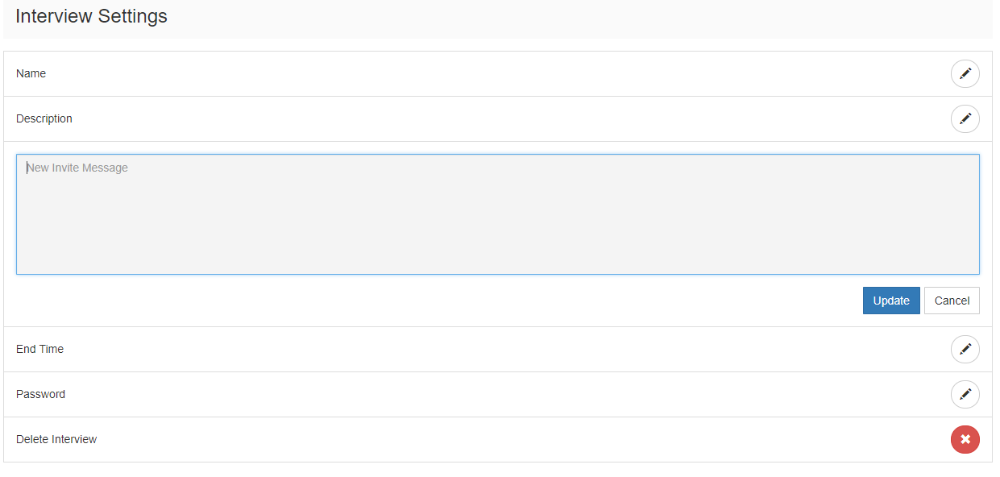

************
Notify Users
************

To notify a user that he or she has been invited, click on on the button outlined in red in the figure below.
An email

    **Figure 1.** Assignments page view

To customize the invite message, visit the settings and edit the **Invite Message** as shown in the figure below.

    **Figure 1.** Assignments page view
