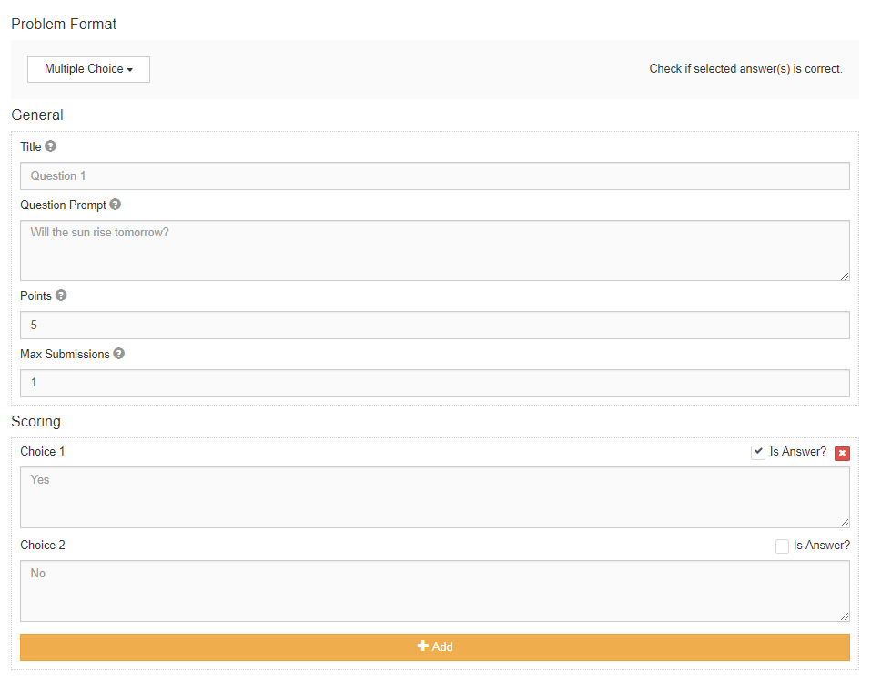

***************
Multiple Choice
***************

Description
===========

With a multiple choice problem, the creator specifies a question prompt and one or more choices. 
One or more of the choices needs to be marked as the correct answer. 

    **Figure 1.** Create multiple choice problem view
