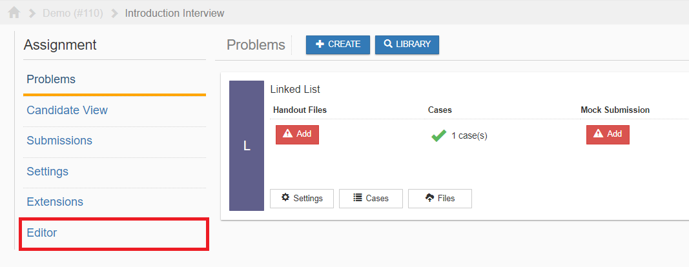

********
Overview
********

Description
===========

A problem is what users will be providing solutions for. Each assignment shares settings from the **Assignment Settings** 
i.e. All problems in an assignment will have the same start and end time.

Problem Types
================

We currently support four types of problems:

    1. Diff
    2. Custom
    3. Multiple Choice
    4. Free Response

Accessing Problem Files
=======================

The files can be accessed by clicking on the the **Editor** section as highlighted in red below.

    **Figure 1.** Editor section 

Submission File Structure
=========================
 
Below is an outline of the file structure of a submission.
Please note that exact path of the submission will be determined after submission is made and will
be placed under **/home/kodethon/.staging**.

.. code-block:: yaml

    metadata.json
    autograder/
      FILES_IN_PROBLEM_AUTOGRADER_FOLDER
    output/
      stdout
      stderr
    submission/
      SUBMISSION_FILES

autograder
^^^^^^^^^^
The specified **test command** will be executed from within the autograder folder. 
All files in **/home/kodethon/PROBLEM_NAME/autograder** will be exposed here as a soft link. 

output/stdout
^^^^^^^^^^^^^
Contains the stdout of the test command.

output/stderr
^^^^^^^^^^^^^
Contains the stderr of the test command.

submission
^^^^^^^^^^
When a submission is made, Kodethon will place the submission files in the **submission** folder. That is, references to the submission files should be made 
via **../submission/FILE_NAME**. 

metadata.json
^^^^^^^^^^^^^
The metadata.json file will be of JSON format as shown below:

::

    {
        first_name: "John",
        last_name: "Doe",
        email: "sample@gmail.com",
        submission_time: "2017-11-26 23:21:02 -0800",
        deadline: "2017-11-30 23:21:02 -0800",
        previous_submissions: [
            {
                output: "Hello World!",
                cache: "<DATA DEFINED BY YOU>",
                remaining_attempts: 5,
                created_at: "2017-11-25 23:21:02 -0800",
                score: 100
            },
            ...
        ],
        on_start: {
            "description": "<DESCRIPTION OF PROBLEM>",
            "created_at": "2017-12-08T05:31:49.093Z",
            "updated_at": "2017-12-13T11:19:11.970Z",
            "data": "<DATA YOUR PROBLEM MAY NEED>"
        }
    }

