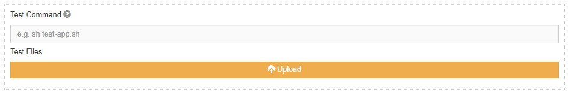

******
Custom
******

.. contents:: Table of Contents

Description
===========

Custom problems allow the creator to have **full control** on how submissions are scored. 
Please be aware that the specified test command will be run as the Linux user **nobody**. 
This means that extra caution should be made to ensure that proper permissions have been set prior to submission.

Settings
========

.. cmdoption:: Test Command

The test command should be a UNIX shell command used to initiate testing. 
This command will be run once from the **autograder** folder as shown in the next section.
The test command should either print to stdout a JSON string denoting the submissions results or write the JSON string to **submission/results.json**

    **Figure 1.** Custom problem scoring settings view

.. cmdoption:: Enable HTML Render

Allows for HTML and CSS files to be rendered as a webpage in the inline editor. Will only be accessible if **Enable Inline Editor** is enabled.

Problem File Structure
======================

A custom problem allows you to upload a zip file containing relevant test files. 
When a custom problem is created, we will generate the folders in /home/kodethon:

.. code-block:: yaml

    PROBLEM_NAME/
        autograder/
        handout/
        .snapshots/
        submission/
        .submissions/

- PROBLEM_NAME/
    This folder will be named ater the problem's title. It will contain the rest of the folders.

- autograder/
    The folder that contains all files needed for scoring a submission. 

- handout/
    The handout folder should contain the files you expect your users to have. 
    For example, it may contain a file called README.

- .snapshots/
    The hidden snapshots folder is where all submissions are stored. 

- submission/
    The test folder can optionally contain a mock submission that can be used to test scoring.

- .submissions/
    The hidden submissions folder is where the latest submission will be stored. 
    Inside each submission folder will be the submitted files along with an output file with your test script's output.

Submission File Structure
=========================

When a submission is made, we will generate the following folders under a new path in .submissions

- autograder/
    This folder contains symbolic links to all files in the problem's autograder folder 

- submission/
    This folder contains the submission files

- output/ 
    It is recommended to place log files here.

A sample submission path will look like:

.. code-block:: text
  
    /home/kodethon/PROBLEM_NAME/.submissions/SUBMISSION_FOLDER

Writing a Test Script
=====================

Below is a recommended outline of a test script:

**1. Accessing the Submission**

We first start in the **autograder** folder, but the the submission files are kept in a separate folder.
To access the submission files, let's move into the **submission** folder.

.. code-block:: shell

    submission_path=../submission
    cd $submission_path

**2. Getting Additional Test Files (Optional)**

Even though test files should be placed in the autograder folder. 
You may want to link additonal files into the **submission** folder.
Let's assume some test files (TEST_FILES_PATH) need to be linked.

.. code-block:: shell

    ln -sf TEST_FILES_PATH $submission_path

**3. Running the Submission**

Once we are in the **submission** folder, let's run the submission. 
As an example, let the submission be called **submission.py**.
In the example below, it is completely optional to save the output into **../output/stdout**

.. code-block:: shell

    python submission.py > ../output/stdout
    
**4. Formatting Results**

Finally, let's format the output to something Kodethon expects and write it to **results.json**
As an example, our formating script is **adapter.py**. Notice how it is referenced as **../autograder/adapter.py**.
This is because we are currently in the **submission** folder and grading scripts are kept in the **autograder** folder.
In the next section, we provide details on how to format the results.

.. code-block:: shell

  cat ../output/stdout | python ../autograder/adapter.py > results.json

Expected Response
=================

The submission results must written to **results.json** in the **submissions** folder.

::

    {
        score: "0.0",
        cache: "Student failed Test Case 1",
        tests: [{
            "name": "Test Case 1",
            "score": 0.0, 
            "max_score": 1.0, 
            "output": "Hello World",
            "answer": "Hello World!"
        }] // Optional
    }

General response descriptions:

- score (Conditionally Required)

    A float that will represent the overall score for the submission. If no score is provided, sum of test case scores will be used instead. 
    This attribute will take precedence over sum of test case scores.

- cache (Optional)

    Can be used to save data for grading the next submission.

- tests (Optional)
    
    An array of cases that provides additional information regarding how the submission was graded.

Test case response descriptions:

- name (Optional)
    
    A label for the test case.

- score (Required)

    The score received for this test case.

- max_score (Required)

    The maximum score for this test case.

- output (Optional)

    The output that the submittter will see.

- answer (optional)

    The expected answer the test case was supposed to output.
