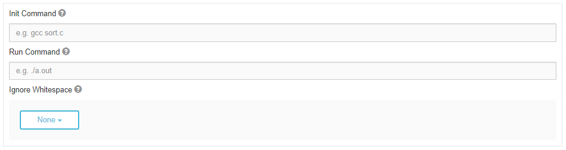

****
Diff
****

.. contents:: Table of Contents 

Description
===========

A diff problem is named after the UNIX diff command that compares the contents of two files.
In our case, we diff the output produced by the submitted files with the expected answer. 
To generate the output from the submitted files, the creator of the problem must specify a **run command**.
The expected answers are specified as **test cases**.

For each test case, you can specify:
    
    1. Standard input (Optional)
    2. Arguments (Optional)
    3. Expected answer (Required)
    4. Comment (Optional)

When a student submits their program for grading, Kodethon will **generate a test script** based on the problem settings and test cases. 
For example, if you set standard input to be 'abc' and arguments '1 2 3' for **Test Case 1**, then the generated test command will look like:

::
    
    run main.py 1 2 3 < 1 

The specified standard input 'abc' will be written into a file called '1' and redirected into the student's program.

Settings
========

.. cmdoption:: Init Command

The init command should be a UNIX shell command used to prepare the submission for testing. This command will be only **run once**.

For example, specifying *gcc main.c* as the init command will create an executable file *a.out* which can then be used by the run command. 

.. cmdoption:: Run Command

The run command should be a UNIX shell command used to execute the submission file. This command will be **run once per test case**.

For example, if the submission file is expected to be called *main.py*, then the corresponding run command should be *python main.py*.

.. cmdoption:: Ignore Whitespace

This setting has three options:
    1. None
    2. Trailing
    3. All

The setting defaults to **None** which is a strict comparison of the submission output and the expected answer; every character is expected to match. 

When the setting is set to **Trailing**, all whitespace characters after the last non-whitespace character is ignored.

When the setting is set to **All**, all whitespace is ignored. For example, *HelloWorld* will match the expected answer of *Hello World*.

    **Figure 1.** Diff problem scoring settings view

Problem File Structure
======================

When a problem is created, the below files are created:

.. code-block:: text

  /home/kodethon/PROBLEM_NAME
    autograder/
      .answers/
      .inputs/
      .arguments/
      .utils/
      test.sh
    handout/
    .ref/
    .snapshots/
    submission/
    .submissions

- autograder/ 
    The folder that contains all files needed for scoring a submission. 

- autograder/.answers/
    The folder where answer files are stored after being added in the test cases.

- autograder/.inputs/
    The folder where stdin files are stored after being added in the test cases.

- autograder/.arguments/
    The folder where argument files are stored after being added in the test cases.

- autograder/.utils/
    Where utility files are stored. This folder should not be modified.

- handout/
    The handout folder should contain the files you expect your users to have.

- .ref/
    If you choose to use a reference program, the uploaded file(s) will be stored here

- .snapshots/
    The snapshots folder is where all submissions are stored. 

- submission/
    The submission folder can optionally contain a mock submission that can be used to test scoring.

- .submissions/
    The hidden submissions folder is where the latest submissions will be stored. 
    Inside each submission folder will be the submitted files along with an output file with your test script's output.

