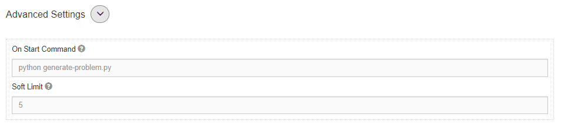

*******
Dynamic
*******

.. contents:: Table of Contents

Description
===========

Dynamic problems are a special type of custom problem that allows a problem creator to provide a unique problem description to each user. 
The problem creator can specify their dynamic problem generation script in **On Start Command** setting for **Custom** problems. The 
**On Start Command** will be triggered when the user copies the assignment or when they view the assignment.

Settings
========

.. cmdoption:: On Start Command

The on start command should be a UNIX shell command. It is run once when a user first views the assignment and
every time the number of submissions hits the soft limit count.

.. cmdoption:: Soft Limit

To control after which submission count the on start command should be run again, set the soft limit to a value greater than 0. 
Otherwise, this setting defaults to 0.

    **Figure 1.** Custom problem advanced settings view

On Start Metadata
=================

The path of the metadata file will be passed in a the last argument to your *On Start Command*. 
The file will be of JSON format as shown below:

::

    {
        first_name: "John",
        last_name: "Doe",
        email: "sample@gmail.com",
        timestamp: "2017-11-26 23:21:02 -0800",
        previous: [
            {
                description: "<PREVIOUS PROBLEM DESCRIPTION>",
                created_at: "2017-11-25 23:21:02 -0800",
                updated_at: "2017-11-25 23:21:02 -0800",
                data: "<PREVIOUS DATA>"
            },
            ...
        ]
    }

- first_name

    A string describing the first name of the submitter.

- last_name

    A string describing the last name of the submitter.

- email

    A string describing the email of the submitter.

- timestamp

    A timestamp string describing when the submission was made.

- previous

    A list of previously generated on start responses.

Expected Response
=================

The below format should be output to stdout as a JSON string:

::

    {
        description: "<YOUR PROBLEM DESCRIPTION>",
        description_format: "[markdown]",
        data: "<ASSOCIATED DATA FOR PROBLEM>",
        data_format: "[input, mc, image]"
    }

- description
    Text describing the problem.

- description_format  (Optional)
    - default
        The description will be rendered in a pre element. 
    
    - markdown    
        The problem description will be rendered as markdown with MathJax support.

- data  (Optional)
    JSON encod-able object 

- data_format  (Optional)
    - image
        If set, expects the data attribute to be of the form:
        
        ::

            {
                base64_str: "",
                mime_content_type: ['jpeg', 'png', ...]
            }
        
    - input
        Not yet supported
    
    - mc
        Not yet supported

