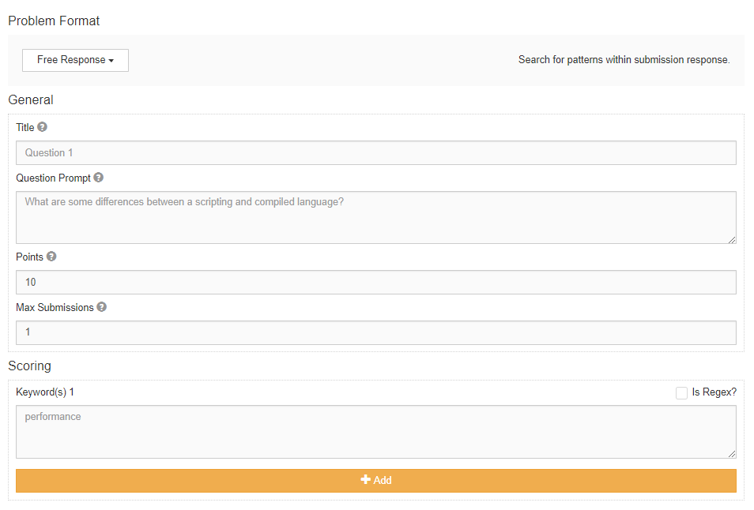

*************
Free Response
*************

Description
===========

With a free response problem, the creator specifies a question prompt and one or more pattern to search for in the submission text.
The pattern can either be a phrase or a regex pattern. For example, if there are two patterns, *Hello* and *Earth*, and the submission
text is *Hello World!*, the submitter will get 50% of the points. 

    **Figure 1.** Create free response problem view
